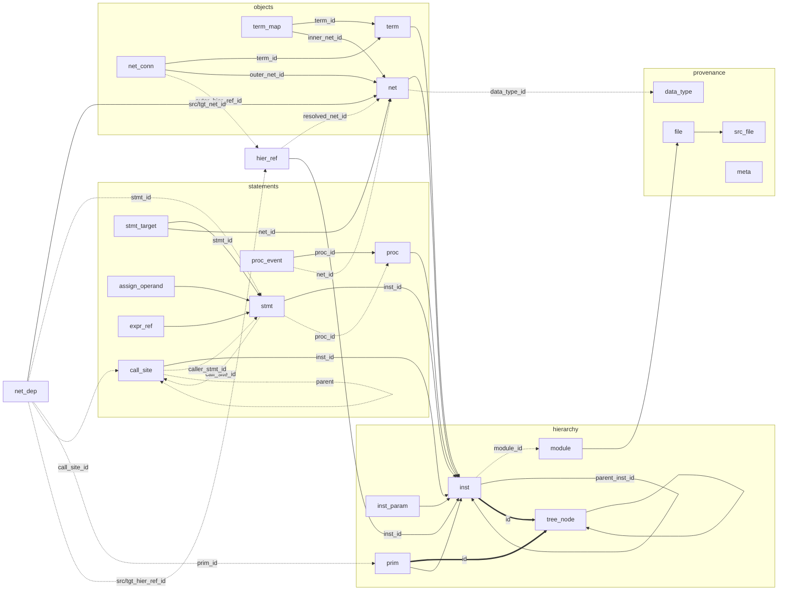

# design.db — the field reference

Schema version 13. The version is the *consumption contract*, not the DDL: a
reader that does not know the number must refuse the file rather than read it
as though the layout held. What bumps it: removing or renaming a table the
contract names, a view or a view column; changing a column's meaning, value
domain, NULL rules, or a view's row granularity; changing the required `meta`
set. What does not: adding a table or column an older reader would merely not
query, or changing how a view is computed while its contract holds.

No database is upgraded in place: a version bump means re-exporting the RTL.

## What it answers

* *Where am I?* `v_tree_node`: one node per level, one path segment per
  node, resolved one indexed lookup per segment.
* *What is here?* `v_net`, `v_term`: every declaration of this
  occurrence, implicit nets flagged, directions on the terminals that have
  them.
* *Who drives it / who reads it?* `v_driver`, `v_load`: every recorded arc,
  in-module and across the boundary, discriminated by kind.
* *Which statement did that?* `v_stmt` and its target/operand views;
  every dependency names its statement.
* *What leaves this instance?* `hier_ref`, as written and — where possible
  — resolved.

## Tables

Twenty-two tables in six groups. Every relationship is a foreign key: a
column named `<x>_id` holds the primary key of another table, and nowhere
else does `_id` appear. The map (arrow points from the table that carries
the key to the table it references; `╌╌` marks the two same-id subtype
links, where `inst.id` and `prim.id` ARE a `tree_node.id`):



`net_dep` also carries the provenance columns `assign_operand_id`,
`stmt_target_id` and `expr_ref_id` (the local reference each end came from);
`hier_ref` carries `resolved_inst_id` beside `resolved_net_id`. Dashed
edges are nullable references (the key is absent for rows the relationship
does not apply to); solid edges are always present.

| Group | Table | One row is | Foreign keys (`col → table`) |
|---|---|---|---|
| provenance | `meta` | one key/value of the seal | — |
| | `src_file` | one file slang read, with its SHA-256 | — |
| | `file` | one path spelling rows carry | `src_file_id → src_file` |
| | `data_type` | one interned type text | — |
| hierarchy | `module` | one source definition | `file_id → file` |
| | `tree_node` | one level of the elaborated tree | `parent_node_id → tree_node` |
| | `inst` | one module/interface/program instance occurrence | `id → tree_node`, `module_id → module`, `parent_inst_id → inst` |
| | `inst_param` | one elaborated parameter value of one occurrence | `inst_id → inst` |
| | `prim` | one gate, switch or UDP instance | `id → tree_node`, `inst_id → inst` |
| objects | `net` | one connectable object of one occurrence | `inst_id → inst`, `scope_node_id → tree_node`, `data_type_id → data_type` |
| | `term` | one terminal on one occurrence's boundary | `inst_id → inst`, `data_type_id → data_type` |
| | `term_map` | one segment of a terminal's inside | `term_id → term`, `inner_net_id → net` |
| | `net_conn` | one segment of a terminal's outside | `term_id → term`, `outer_net_id → net`, `outer_intf_inst_id → inst`, `outer_hier_ref_id → hier_ref` |
| statements | `proc` | one always/initial/final block | `inst_id → inst`, `scope_node_id → tree_node` |
| | `call_site` | one subroutine-body expansion (a call) | `inst_id → inst`, `caller_stmt_id → stmt`, `parent_call_site_id → call_site` |
| | `stmt` | one statement or statement-level construct | `inst_id → inst`, `scope_node_id → tree_node`, `proc_id → proc`, `call_site_id → call_site` |
| | `stmt_target` | one statement's target reference (LHS, release, system write) | `stmt_id → stmt`, `net_id → net` |
| | `assign_operand` | one assignment right-hand-side reference | `stmt_id → stmt`, `net_id → net` |
| | `expr_ref` | one non-operand read, classified by role | `stmt_id → stmt`, `net_id → net` |
| | `proc_event` | one edge event triggered or waited on | `proc_id → proc`, `stmt_id → stmt`, `net_id → net` |
| dataflow | `net_dep` | one net-to-net dependency occurrence | `src_net_id`/`tgt_net_id → net`, `stmt_id → stmt`, `prim_id → prim`, `call_site_id → call_site`, `assign_operand_id`, `stmt_target_id`, `expr_ref_id`, `src_hier_ref_id`/`tgt_hier_ref_id → hier_ref` |
| boundary | `hier_ref` | one reference that leaves its instance | `inst_id`/`resolved_inst_id → inst`, `stmt_id → stmt`, `resolved_net_id → net` |

The DDL in `src/sql/Schema.inc` carries the authoritative per-column comments;
this file states the semantics a consumer builds on. The columns of each
table follow.

### Hierarchy

**`module`** — `id, name, def_kind, file_id, line, column`, unique on
(name, file_id, line). `def_kind` is `module | interface | program |
checker | package` (a package's pseudo-occurrence carries a `module` row of
its own, see *Packages*). However many parameterisations elaborate, the
definition is one
row.

**`tree_node`** — `id, parent_node_id, name, node_kind, ordinal`. One path
segment per node, `[i]` included for array elements (`u[0]`, `lane[3]`), so
resolving `a.b[0].c` is one indexed lookup per segment against
(parent_node_id, name) and no path strings are stored. An anonymous gate
(`buf (y, a);`, the usual spelling in cell models) has no segment of its
own in the source, so it gets a synthesised one — `$buf$0`: `$`-prefixed
so it cannot collide with an identifier the source could have written,
counted per scope so siblings differ. Without it an anonymous gate would
answer to the name of the instance holding it, and (parent_node_id, name)
would stop being a lookup. `ordinal` is the
order among siblings. `node_kind`:

* `root` — a top instance; has an `inst` row, no parent.
* `instance` — a resolved module/interface/program instance; has an `inst`
  row.
* `generate` — a generate block or one element of a generate array. A
  naming level; nothing subtypes it.
* `primitive` — a gate, switch or UDP; has a `prim` row.
* `unresolved` — an instantiation whose definition slang could not find;
  has an `inst` row with `module_id` NULL and `unresolved_def` set.
  A trace stops here, which is distinct from stopping at a gate.
* `package` — a package, a pseudo-occurrence above the roots: an `inst`
  row with `parent_inst_id` NULL and a `module` of `def_kind='package'`,
  its variables `net` rows. It is not in the elaborated tree — it has no
  parent and instantiates nothing — but the object rows let a `pkg::x`
  reference resolve to a real net. See *Packages*.

The verifier holds the bijections: instance-like kinds (`root`, `instance`,
`unresolved`, `package`) have `inst` rows and no others do; `primitive`
likewise. Parentless nodes are exactly the roots and packages.

**`inst`** — `id` IS the tree_node id (one id space for the hierarchy).
`parent_inst_id` is the nearest enclosing module instance, skipping generate
levels — the ancestry `tree_node` already encodes, denormalised one hop
because every ownership rule walks it; the verifier holds the two encodings
equal. `param_signature` is the elaborated parameter values, normalised,
declaration order, localparams included — it over-splits and never
under-splits, so two instances share a signature exactly when they share a
body. Instances of one module with one signature carry identical row sets.
Location is the instantiation site; the root has none.

**`inst_param`** — `param_signature` made queryable: `(inst_id, ordinal,
name, value)`, one row per elaborated parameter value, declaration order,
localparams and type parameters included — the same normalisation the
signature is built from, and the verifier holds the two representations
byte-for-byte equal per occurrence. "Every instance with WIDTH=8" is an
indexed seek on `(name, value)` here, rather than a `LIKE` over the
signature text that would also match `XWIDTH=8`.

**`prim`** — `id` IS the tree_node id; `inst_id` the instance whose
body wrote it; `prim_kind` is `gate | switch | udp` — `switch` is the
LRM's whole switch family (tran/tranif\*, the resistive variants, and the
MOS switches), not just what slang labels bidirectional; `def_name`
the gate's own word (`and`, `tranif1`) or the UDP's name. A primitive is not
a statement and has no terminals of its own: its dataflow is `net_dep` rows
carrying `prim_id`, one per LRM (input, output) pairing — an `inout` end
couples both ways, one row per direction, self-pairing excluded, so a
`tran a b` is exactly the two arcs a↔b. Expression
operators (`&`, `+`, `?:`) are not primitives — they stay inside their
statement's rows.

### Objects

**`net`** — every object that can be driven, read or wired: nets and
variables, of the instance body and its generate scopes, and — because a
dependency end is an id and an id must exist — subroutine formals, locals
and block variables, named by their scope-relative dotted path (`bump.v`,
`g[0].sig`). Parameters, type parameters and specparams are *not* here:
they are not connectivity. `decl_kind` is
the net type's own word (`wire`, `wand`, `trireg`, a user-defined nettype's
name) or `variable`. `is_implicit=1` marks a net slang created for an
undeclared identifier under the active `` `default_nettype ``; its location
is the first use. `width` is the flattened bit width, NULL when the type is
not integral — bit *offsets* still index the flattened space slang computes
for unpacked objects, so ranges on a NULL-width net remain meaningful.
`scope_node_id` is the instance or generate node that declares it.

**`term`** — one terminal per port, in port-list order (`ordinal`). The
root's terminals are the design's top-level ports; a child's are the pins
its parent connects — one noun, because they are the same object seen from
two sides. `term_kind` is `signal | interface`; `direction` is `input |
output | inout | ref`, NULL for an interface terminal (it has none) and for
a terminal of an unresolved instance (nobody knows). `modport` is the
declared modport, when the port declares one. A non-ANSI `.p({hi, lo})`
formal is one terminal whose inside has two segments. An unresolved instance
still gets terminal rows — one per connection its parent wrote, named as
the connection names them — so "connected to a black box" stays distinct
from "unconnected".

**`term_map`** — the INSIDE of a terminal (VPI's lowConn): which nets of
its own instance it stands for, one row per segment, keyed (term_id,
ordinal). An ANSI port is one whole-to-whole segment with `map_exact=1`; a
port expression produces one segment per element with its window of the
terminal (`term_lo/term_hi`) and of the net (`inner_lo/inner_hi`). Both
nets belong to the terminal's own instance; the outside is `net_conn`'s
business, and the two relations are kept apart so neither side's window is
mistaken for the other's.

**`net_conn`** — the OUTSIDE of a terminal (VPI's highConn): what the
parent wired to it, one row per atomic segment. Each concatenation element
and each replication copy is its own row with its own window of the formal
— `.q({2{r}})` is two rows whose windows tile `q`. `conn_kind` decides
which outer column is set — the kind first, then its pointer:

| conn_kind | outer end | |
|---|---|---|
| `signal` | `outer_net_id` | a net of the parent instance |
| `constant` | — | a tie-off; the term window is kept so the formal's bits tile without a gap |
| `unconnected` | — | recorded, not omitted: absence would also mean "the exporter did not get this far". Claimed only for a pin the parent left empty — a connection whose shape this schema cannot spell (a sequence expression against a black box) records the nets it reaches as `expression_operand` instead |
| `expression_operand` | `outer_net_id` or `outer_hier_ref_id` | the actual is an expression; this row is one net it reads. `.en(state == RUN)` samples `state` but does not alias it to `en`; `map_exact` is 0 by construction |
| `interface` | `outer_intf_inst_id` | the bound interface instance, through pass-through chains: a grandchild handed the parent's own interface port resolves to the instance the parent was handed. NULL when the binding has no per-occurrence object (an interface array element). No dataflow arc pretends to cross an interface binding |
| `external_reference` | `outer_hier_ref_id` | tied to something with no name in the parent (`.p(u.g[7:4])`); the reference says what, with `access='connect'`. It crosses like any other connection once the reference resolves — with a `map_exact` of its own, so the arc is traceable bit by bit — while an upward tie (`.a(tb.glob)`) stays a recorded connection with no arc |

Width degradation: when the connection expression's width and the declared
terminal width disagree (an output narrower than the net it drives arrives
as a plain assignment with no conversion node), every element's position is
unstatable and no mapping is per-bit — `term_exact=0`, `map_exact=0`,
the same degradation a width-changing conversion gets. Instance-array
elements share the whole array's connection expression and degrade the same
way. Connections to an unresolved instance have no formal to measure
against: their terminal side is NULL and `map_exact` NULL.

### Statements

**`proc`** — one row per always/always_ff/always_comb/always_latch/
initial/final block, `ordinal` in declaration order. Task and function
bodies do not get procedure rows: their statements belong to the calling
procedure — a `=` inside a function reached from an `assign` is still
`blocking`, and executes in no procedure (`proc_id` NULL).

A body is walked **once per call site**, not once per subroutine. The
statements are the effect of *that* call, so they carry its gating stack
and its delay:

```systemverilog
always_ff @(posedge clk) begin
    if (g1) put(d1);
    if (g2) put(d2);
end
```

records the body's write twice, once under `g1` and once under `g2` — each
call carries its own gating.

Recursion is bounded by an active-call guard, so a self-calling task is
expanded once, not forever. Fan-out is bounded by a per-module budget: the
guard stops cycles but not a call DAG that branches, which costs 2^depth,
so a module that exceeds the budget stops instantiating bodies, counts the
call sites it skipped, and reports `analysis_status='partial'`. Measured
RTL does not come close — the heaviest caller among the designs exported
here has thirteen call statements.

**`call_site`** — `id, inst_id, caller_stmt_id, parent_call_site_id,
subroutine_name, depth`. One row per subroutine-body expansion, i.e. per
call. It exists because a body is walked once per call site and the formal
net is shared: without a per-call tag, a cone mixes the calls. Every `stmt`
and `net_dep` a body walk produced points here through `call_site_id`;
`parent_call_site_id` chains nested calls into a call string, `depth` is 1
at the outermost call, and `caller_stmt_id` is the statement that made the
call (NULL for a call in a control expression). See *Tracing across calls*.

**`stmt`** — one row per statement or statement-level construct; `{a,b} =
{x,y}` is ONE row however many targets it writes. `stmt_kind` is
`assignment | assertion | wait | call | system_task | event_control |
alias | release`;
`construct` the construct's own word (`assign`, `always_ff`, `assert`,
`$display`, `call`, `sensitivity`, `wait` — and `force`/`proc_assign` on
the assignment a `force` or procedural `assign` makes, `release`/
`deassign` on a release row). `assign_kind` (`continuous |
blocking | nonblocking`) is set exactly on assignments; `sequence` is
execution order within the procedure (NULL outside one, and on the
procedure-header `event_control` row that holds a non-plain sensitivity's
reads). `delay` is the delay control's normalised source text — `#3`,
`#(rise, fall)` — never a number this tool pretended to evaluate; intra-
assignment delays land on their own statement. `dropped_operand_count` is
operands not recorded: compile-time constants, and references that could not
be stored as a path.

**`stmt_target` / `assign_operand`** — the statement's target and its
right-hand references, (stmt_id, ordinal)-unique, in written order.
`stmt_target` is any statement's target, not only an assignment's — a
release names its lvalue here (fed by no dependency: releasing is not
driving, so the rows answer "where does the force end", never "who drives
this"), and a system task names its write target here — which is why it
is not `assign_target`. `assign_operand` keeps its name: an operand is an
assignment RHS read and nothing else produces one. Operands belong to the
STATEMENT, not to a target: which operand feeds which target is
`net_dep`'s answer, and pairing them here would be a cross product — for
`{a,b} = {x,y}`, four pairings where the RTL has two. A read occurring
twice is two rows. A target outside the instance
is not here — it is a `hier_ref` with `access='write'` on the same
statement.

**`expr_ref`** — every statement read that is not an assignment operand,
classified: `control` (a branch condition over the statement — including one that
writes nothing this instance names, where no dependency can carry it and
this reference is the only record),
`assertion`, `wait` (a wait's condition), `event` (a sensitivity expression
that is not a plain net), `call_argument`, `system_task`. One read lands in
exactly one of `assign_operand`, `expr_ref` or `proc_event` — the verifier
holds the view formulas that make double counting visible.

**`proc_event`** — one row per event a procedure triggers on
(`event_kind='sensitivity'`, `stmt_id` NULL) or waits on (`'wait'`, the
statement set). All of them, since an event list has no order. `edge_kind`
is `posedge`/`negedge`/`both`, or NULL for a level-sensitive event written
explicitly (`always @(b)`) — the event is a fact whether or not it names an
edge, and a signal appearing *only* in a sensitivity list is otherwise
invisible to every load query. `net_id` is NULL when the expression is not
a plain net; the reads then live as `expr_ref` rows with role `event`.

An *implicit* list (`always @*`, `always_comb`, `always_latch`) gets no
event rows: its sensitivity is the read set the dataflow rows already
carry. The clock is not identified.

### Dataflow

**`net_dep`** — the adjacency list `v_driver` and `v_load` index, and a
provenance record: every dependency names where it came from. One row per
statement- or primitive-level dependency occurrence: the same source
reaching the same
target from two statements is two rows, each naming its statement. `{a,b} =
{x,y}` is `x -> a` and `y -> b`, each naming its operand and target rows —
never the four-way cross product. `dep_kind`, and what must be set
(verifier-enforced):

| kind | means | names |
|---|---|---|
| `data` | an assignment moves it | `stmt_id`, and per end either the local reference (`stmt_target_id` / `assign_operand_id`) or the hierarchical one (`tgt_hier_ref_id` / `src_hier_ref_id`) — exactly one of the two per end. `src_net_id` NULL *with no source reference of either kind* is a constant driver (`q <= 8'h0`); the row still names the statement, and every src column is NULL with it. `src_net_id` NULL *with* `src_hier_ref_id` is an **external** driver: the reference did not resolve to a net row, the spelled window survives, and `v_driver` says `'external'`. |
| `control` | it reaches the target through a branch condition | `stmt_id`, the condition as `expr_ref_id` (role `control`) or `src_hier_ref_id`, the target as `stmt_target_id` or `tgt_hier_ref_id`; `map_exact` 0 — a condition gates, it does not map |
| `primitive` | a gate/switch/UDP couples them | `prim_id`, per LRM (input, output) pairing; scalar-to-scalar couplings are per-bit |
| `alias` | an `alias` statement binds them into one object | `stmt_id`, and both an `stmt_target_id` and an `assign_operand_id`, since every name an alias binds is written and read at once. One row per ordered pair: `alias a = b = c;` binds every pair mutually rather than in a chain, so it is six rows, not two. `map_exact` is 1 — an alias is bit for bit by definition — unless a side could not be narrowed. |
| `procedure` | a call binds them | actual to formal by argument direction, formal to actual for outputs; `stmt_id` the calling statement (NULL for a call in a control expression), `expr_ref_id` (role `call_argument`) or `src_hier_ref_id` on the reading side |

A dependency can cross by name on the target side with no source:
`assign u.x = 8'h5A;` and `$readmemh("f.hex", u.mem)` drive an object in
another instance from a source this schema does not name. They record a
source-less dependency against the resolved target, `dep_kind='data'`, and
`v_driver` reports the far net's driver as `constant` or `system_task`.

**Dataflow that crosses by name.** `assign q = u.x;` and a modport write
carry the resolved net at both ends and name the `hier_ref` row the
reference went through in place of a local operand/target row. The pairing
is made where the statement was walked — one row per (source element,
target element) that share bits.

On failure the two ends differ. An unresolved TARGET produces no
dependency, since `tgt_net_id` is NOT NULL. An unresolved SOURCE keeps its
row — `src_net_id` NULL, `src_hier_ref_id` set — and surfaces in
`v_driver` as `driver_kind='external'`; this distinguishes a signal driven
through an unresolvable name from an undriven one.

`src_net_id`/`tgt_net_id` repeat the referenced rows' net ids; the verifier
holds the copies equal.

### Leaving the instance

**`hier_ref`** — one row per (reference, direction, statement) that leaves
its instance: an XMR, an interface member, a package item. `path` is the
canonical text as written (selects resolved to the constants they
elaborated to, whitespace and comments removed); `access` is
`read | write | connect`. The statement is part of the identity because a
task body is walked once per call site: two calls to a task reading `u.x`
are two statements and two rows, so "what does *this* statement read
outside the instance" has an answer for each.

The range is the one the RTL spells, not the one a dependency uses.
`assign {hi, lo} = u.x;` records one reference to the whole of `u.x`,
while the two dependencies through it carry `[7:4]` and `[3:0]` in
`net_dep` — where a range describes a particular dependency rather than
the reference itself. Because an occurrence knows its place in the
hierarchy, `resolved_inst_id` and `resolved_net_id` name the actual rows
when the export can replay the reference —

* downward (`u_cnt.cnt`): resolved, per occurrence;
* absolute paths into the exported tree: resolved;
* through one of the instance's own interface ports (`bus.vld`, modports
  included): resolved to the interface instance each occurrence is actually
  bound to;
* package items (`pkg::mask`): resolved to the package's net (see
  *Packages*), the same for a bare name imported from the package;
* upward references and interface-array bindings: NULL. The one analysed
  body speaks for occurrences whose surroundings may differ, so the target
  is not resolved per occurrence.

NULL `resolved_*` means not resolved here. A dependency whose source went
through an unresolved reference is still written and surfaces in `v_driver`
as `'external'`, naming this row.

## Bit ranges

One encoding everywhere. A range is LSB-relative offsets
into the flattened object, NOT declared indices: `logic [15:8] off` has bit
15 at offset 7, `logic [0:7] up` has bit 0 at offset 7. A consumer that maps
offsets straight onto declared indices mislabels every signal not declared
`[N-1:0]`; the declared shape is recoverable from the type text.

* NULL bits with `exact=1` — the whole object.
* NULL bits with `exact=0` — somewhere inside it, unknown where.
* present bits with `exact=1` — exactly those bits.
* present bits with `exact=0` — an upper bound, not the bits actually
  touched (a dynamic selector).

`map_exact` describes the correspondence BETWEEN the two ends, not either
end's own range. `q = a + b` has both ranges exact yet no per-bit
correspondence, because a carry crosses them: `map_exact=0` there is range
granularity, not doubt about the dependency. NULL means no second end to
correspond with (a constant, an unconnected pin).

Columns describing an end that does not exist are NULL together. The one
exception: an `'external'` dependency's source end exists — the reference
names it — so its window and `map_exact` are set beside a NULL
`src_net_id`.

**Reading a dynamic index.** `out = mem[raddr]` is ONE dependency row —
`mem` is one net however wide — with `src_lo/src_hi` NULL and
`src_exact=0`: somewhere in `mem`, upper bound the whole of it. The address
is a separate operand: `raddr` has its own data dependency onto `out`. A
tracer following `exact=0` through `mem` admits every writer of `mem`; the
flag marks the hop where bit precision is lost.

## The stable query interface

Fourteen views. Their existence, column sets and order, column semantics,
NULL rules and row granularity are the contract; `verify-designdb.py`
asserts all of it on every export. Ground rules:

* A FACT view's row is one base-table row — `v_tree_node`, `v_net`,
  `v_term`, `v_term_map`, `v_net_conn`, `v_net_dep`,
  `v_stmt`, `v_stmt_target`, `v_stmt_operand`, `v_call_site` — and
  count(view) == count(base) is checked. Every internal join is against a
  primary key; nothing fans out.
* `v_driver`, `v_load` and `v_net_attachment` are COMPOSITE: UNION ALL
  branches discriminated by their kind column, each branch's row count
  reconcilable by a formula the verifier evaluates. The dependency, event,
  statement and terminal branches reconcile against base tables; the two
  crossing branches reconcile against the `(net_conn, term_map)` overlap
  recomputed from the base tables, and a separate check pins
  `count(v_conn_arc)` to that same overlap — so a fault inside the
  composition breaks a count even though both composite views would still
  self-reconcile.
* `v_conn_arc` exists in the file but is NOT contract: it is the scaffolding
  the two composite views share, may change or vanish without a version
  bump, and consumers must not query it.
* Point queries seek. `v_driver`, `v_load` and `v_net_attachment` by
  `signal_net_id`/`net_id`, `v_net_dep` by `tgt_net_id`, `v_net_conn` by
  `outer_net_id`
  use an index, never a base-table scan — the closure is the consumer's,
  one point query per hop, so a scan per hop would be a scan per net in
  the cone. The verifier asserts the query plan itself; a change to how a
  view is computed that regresses this fails the export rather than
  shipping a database that answers slowly.
* Explicit column lists, never `SELECT *`; no transitive closure — a
  fan-in cone is the consumer's recursive query, one step per row here.

**`v_db_info`** — the meta seal as one row, counts CAST to INTEGER:
`schema_version, tool_version, slang_version, producer_revision, top,
analysis_status, error_count, unresolved_count, empty_procedure_count,
duplicate_path_count, config_digest`.

**`v_tree_node`** — one row per node: `node_id, parent_node_id, node_name,
node_kind, ordinal, inst_id, parent_inst_id, module_id, module_name,
param_signature, def_name, file_path, src_path, src_line,
src_col`. NULL by kind: `generate` has no subtype columns; `primitive`
has `inst_id` NULL, `parent_inst_id` its owning instance and
`def_name` the gate/UDP name; `unresolved` has `module_id` NULL and
`def_name` the unresolvable spelling; the root and generate levels
have no location.

**`v_net`** — one row per net: `net_id, inst_id, module_id, module_name,
param_signature, scope_node_id, net_name, decl_kind, data_type,
width, is_implicit, file_path, src_path, src_line, src_col`.
No direction column — direction belongs to terminals, and a net's port-ness
is one `v_term_map` join away.

**`v_term`** — one row per terminal: `term_id, inst_id,
module_id, module_name, term_name, term_kind, direction, data_type,
width, ordinal, is_const, modport, file_path, src_path, src_line,
src_col`.

**`v_term_map`** — one row per inside segment: `term_id,
term_inst_id, term_name, map_ordinal, inner_net_id,
inner_net_name, term_lo, term_hi, term_exact, inner_lo, inner_hi,
inner_exact, map_exact`.

**`v_net_conn`** — one row per outside segment: `conn_id,
outer_net_id, outer_inst_id, outer_net_name, term_id, term_inst_id,
term_name, direction, conn_kind, ordinal, outer_lo, outer_hi,
outer_exact, term_lo, term_hi, term_exact, map_exact,
outer_intf_inst_id, outer_hier_ref_id, file_path, src_path, src_line,
src_col`. Not composed with `term_map`; `v_driver`/`v_load` are the
composition.

**`v_net_dep`** — one row per dependency: `dep_id,
src_net_id, src_inst_id, src_name, src_lo, src_hi,
src_exact, tgt_net_id, tgt_inst_id, tgt_name, tgt_lo,
tgt_hi, tgt_exact, stmt_id, assign_operand_id, stmt_target_id,
expr_ref_id, prim_id, src_hier_ref_id,
tgt_hier_ref_id, dep_kind, map_exact, call_site_id, file_path, src_path,
src_line, src_col`. Location is the statement's, or the
primitive's for a primitive arc. A row whose `src_inst_id` and
`tgt_inst_id` differ crossed by name; the `*_hier_ref_id` column on
that end names the reference it went through. `call_site_id` is set when
the row was produced walking a subroutine body (NULL at module level).
Not deduplicated.

**`v_driver`** — every direct driving arc of `signal_net`, one row each:
`signal_net_id, signal_inst_id, signal_name, signal_lo, signal_hi,
signal_exact, driver_net_id, driver_inst_id, driver_name, driver_lo,
driver_hi, driver_exact, driver_kind, dep_id, conn_id,
stmt_id, prim_id, term_id, map_exact, call_site_id, file_path,
src_path, src_line, src_col`. `driver_kind`:

* `data | control | primitive | procedure` — a `net_dep` row, kind carried
  through, including when it names no driver net. `primitive` with a NULL
  `driver_net_id` is a gate with no input terminal (`pullup`, `pulldown`);
  `procedure` with one is a call into a subroutine declared outside this
  instance, whose formal is no net here. Only a `data` row without a source
  is a `constant` — reporting a weak driver or an unnameable one as a
  tie-off inflates a multiple-driver count with a conflict that is not one.
* `connection` — the crossing: for an input/inout/ref terminal the
  parent-side net drives the child's internal net; for output/inout/ref the
  internal net drives the parent's. `inout` and `ref` arc both ways, one
  row each. An external tie (`.p(u.g[7:4])`) whose reference resolved
  crosses the same way, its far net as the outer end; one that did not
  resolve contributes no arc. The two windows are
  intersected on the terminal; a side's range is narrowed through the
  overlap when every link of its chain is exact, and degraded to `exact=0`
  otherwise. Interface bindings do not arc.
* `connection_expression` — the actual is an expression; each net it reads
  drives the internal net at range granularity.
* `constant` — a tie-off or constant right-hand side: `driver_net_id` NULL
  and every driver column NULL with it; `stmt_id` or `conn_id` names its
  origin.
* `external` — the source is a reference this export has no net row for:
  an upward name from a shared body, an interface-array binding.
  `driver_net_id` is NULL and the dependency's `src_hier_ref_id` names the
  reference (path, location, resolution NULL). Unlike a constant, the
  driver window is set: the referenced object's bits are known.
* `alias` — an `alias` statement binds the two nets into one object. Both
  directions exist, so each is the other's driver and the other's load;
  the kind excludes it from a multiple-driver count. `v_net_attachment`
  spells the same exclusion as `alias_binding`, for the reason
  `release_target` exists: the storage is a `stmt_target` row, and the
  statement writes nothing.
* `system_task` — a system task wrote the argument. `driver_net_id` is
  NULL, as for a constant, because the source is a file or a plusarg
  rather than a net; `stmt_id` names the call.
* `terminal` — the design boundary. A root instance's input/inout/ref
  terminal drives the net it stands for: `driver_net_id` is NULL (the
  world outside the export is the driver) and `term_id` names the pin.
  It separates a net that reaches the boundary from one nothing drives.

An unconnected terminal contributes no row.

**`v_load`** — every recorded read of `signal_net`, one row each:
`signal_net_id, signal_inst_id, signal_name, signal_lo, signal_hi,
signal_exact, load_net_id, load_inst_id, load_name, load_lo, load_hi,
load_exact, load_kind, dep_id, conn_id, stmt_id,
proc_id, term_id, map_exact, call_site_id, file_path, src_path,
src_line, src_col`. `load_kind`: `dataflow` (a dependency reads
it), `connection` (the crossing reads it; `load_net` is the far side),
`alias` (the other name the same object goes by),
`sensitivity`, `wait`, `statement` (an assertion, a `$display`, a read
whose statement has no local target — including the *condition* gating
such a statement, which no dependency can carry), `terminal` (a root output/inout/ref
terminal reads the net it stands for — the boundary counterpart of
v_driver's `terminal`). The last four have `load_*` NULL: a reader with no
nameable target. One read, one row: a reference already carried into
`dataflow` by a dependency is not repeated as `statement`. Membership
follows the netlist model — a clock net's loads include the flop clock
pins, so a sensitivity is a load.

**`v_stmt`** — one row per statement: `stmt_id, inst_id,
module_id, module_name, scope_node_id, proc_id, ordinal, sequence,
stmt_kind, construct, assign_kind, delay, dropped_operand_count,
file_path, src_path, src_line, src_col`.

**`v_stmt_target` / `v_stmt_operand`** — one row per reference:
`target_id/operand_id, stmt_id, ordinal, net_id, net_name, tgt_lo/hi/
exact` (targets) / `operand_lo/hi/exact` (operands — no classic
abbreviation, so the word stays whole).

**`v_net_attachment`** — everything touching one net, one row per
attachment: `net_id, inst_id, net_name, attachment_kind, lo, hi, exact,
stmt_id, term_id, stmt_target_id, assign_operand_id, expr_ref_id,
proc_id, dep_id, hier_ref_id`. The structural adjacency the directional
views cannot ask flatly — "what hangs off this net" — with
`attachment_kind` naming the relation and exactly ONE of the seven typed
id columns pointing at that relation's own row (the exclusive-arc shape
`net_dep` uses, not one polymorphic id): `terminal_inside` /
`actual_outside` → `term_id`; `written_by` / `release_target` /
`alias_binding` →
`stmt_target_id`; `read_by` → `assign_operand_id`; `condition` /
`statement_read` → `expr_ref_id`; `event` → `proc_id`; `dep_in` /
`dep_out` → `dep_id`; `named_from_outside` → `hier_ref_id`. `lo/hi/exact`
are this net's window in the attachment. Each branch is one base
selection, count-reconciled; a point query by `net_id` seeks on every
branch; and the verifier holds that exactly one typed id is non-null per
row and is the one `attachment_kind` implies.

**`v_call_site`** — one row per subroutine-body expansion: `call_site_id,
inst_id, module_id, module_name, caller_stmt_id, parent_call_site_id,
subroutine_name, depth`. The context a `stmt` or `net_dep` names in its
`call_site_id`; `parent_call_site_id` chains nested calls into a call
string. See *Tracing across calls*.

`file_path` is the spelling as written in the filelist; `src_path` the
absolute path it resolved to. They answer different questions and neither
substitutes for the other.

## Naming rules

One classic abbreviation per word, never mixed with the full spelling, and
table and view surfaces share it — an object has one name everywhere. The
dictionary:

| word | | word | | word | |
|---|---|---|---|---|---|
| instance | `inst` | statement | `stmt` | source | `src` |
| terminal | `term` | procedure | `proc` | target | `tgt` |
| connection | `conn` | primitive | `prim` | declaration | `decl` |
| dependency | `dep` | expression | `expr` | definition | `def` |
| hierarchy | `hier` | reference | `ref` | assignment | `assign` |
| interface | `intf` | parameter | `param` | mapping | `map` |
| database | `db` | column | `col` | | |

Only identifiers are abbreviated: enum values and meta keys are data, mostly
the LRM's own words, so `'interface'` and `schema_version` stay spelled out.
Role words stay whole (driver, load, signal, resolved, parent, scope, node).
A word with no classic abbreviation is not given an invented one (operand,
ordinal, sequence, signature, width).

* Tables are `singular_snake_case`. `_id` appears exactly where a column
  holds another table's primary key, and nowhere else.
* A bit range is prefixed with the end it describes (`src_lo`,
  `term_exact`); a single-range table spells its own bare (`lo`/`hi`/
  `is_exact`).
* The two sides of a terminal are `outer_*` (what the parent wired — the
  actual; VPI's highConn) and `inner_*` (what the pin stands for inside;
  vpiLowConn). Direction words never name structure: an `inout` pin's
  outer net drives AND loads the inner one, so driver/load vocabulary
  belongs to `v_driver`/`v_load`, which derive it per port direction.
* Kinds, directions and roles are their words. The words are a wire format
  fixed by this schema, not slang's enum printer. Enum values and meta keys
  are data, not identifiers: they stay full words.
* `ordinal` is position in a declaration or extraction list; `sequence` is
  execution order inside a procedure. Neither is an identity.

For a reader arriving with netlist instincts, the objects are the ones the
EDA standards already name:

| here | elsewhere |
|---|---|
| `net` | OpenAccess oaNet, VPI vpiNet |
| `term` on the root | OpenAccess oaTerm — the block-boundary port |
| `term` on a child | OpenAccess oaInstTerm — the instance pin |
| `net_conn` | VPI vpiHighConn — the pin's outside |
| `term_map` | VPI vpiLowConn — the pin's inside |
| `net_dep` | one hop of a fanin/fanout traversal |
| `hier_ref` | an XMR |

* Every id is issued by the exporter in one pass; 0 is never an id. The
  REFERENCES clauses are enforced by the verifier's `foreign_key_check`,
  not per-insert — and the enum CHECK clauses are, by default, not in the
  shipped file at all: a string IN-list evaluated per row costs more than
  the rest of the insert, so the exporter writes them only under
  `--check-constraints`, and the verifier re-derives every domain from the
  finished file either way. The value domains are contract and are listed
  in this document; their CHECK spelling in the file is not.

## Provenance

`src_file` holds every file slang actually read, absolute path and
SHA-256, so a consumer can tell whether the database and the RTL diverged.
`file` holds the spellings rows carry — as written in the filelist —
joined to their src_file. `meta` is the seal; its required keys are the
`v_db_info` columns plus `tool`, except `top` — the space-separated names
of the elaborated top instances — which is absent when the design
elaborates none.
`analysis_status` is `complete | partial | hierarchy_only` and agrees with
the counts beside it: errors, skipped procedures, duplicated paths (two
siblings sharing one (parent, name) pair, so a path lookup stops resolving
uniquely) and truncated call expansions make `partial`. Unresolved
instantiations do not. `unresolved_count` counts unresolved
instantiation *sites* (one per written instantiation, however many
occurrences stamp out); the per-occurrence picture is
`tree_node.node_kind='unresolved'`. `config_digest` fingerprints the inputs;
two exports with one digest saw the same filelist, defines and flags.

A `hierarchy_only` database of an infinitely recursive design holds a
*prefix* of the elaborated tree: an instance whose module is already one of
its own ancestors keeps its own nets, terminals and incoming connections but
has no children, because the recursion has no end. One such level is
recorded per recursion, not the depth slang happened to reach before it
rejected the design.

## What is not here

* No clock domains, no `clocked` flag, no election of "the" clock. That
  needs constraints this tool does not read; both events of
  `@(posedge clk or negedge rst_n)` are recorded, and the choice is the
  reader's.
* No branch-condition truth tables on statements. Which assignment "was in
  effect" is not evaluable from a waveform by SQL. The conditions are
  recorded — as `control` dependencies with their expression references —
  and the evaluation is the reader's.
* No source text. The file, line and column are here; the text is in the
  file.
* No expression trees, no temporaries. `assign y = (a & b) | c` is three
  operands, three dependencies onto `y`, `map_exact=0`, and no
  fabricated `tmp` net. A consumer that needs the expression's shape reads
  the source at the location the row names.
* A system task that writes an argument — `$readmemh` into a memory,
  `$sscanf` or `$value$plusargs` into a variable, `$cast` into its
  destination — records a target and a source-less dependency, surfacing
  in `v_driver` as `system_task`. The signal is driven; the source is a
  file or a plusarg, outside anything this schema names, and the kind is
  distinct from `constant`.
* `force` records as a blocking assignment marked `construct='force'`
  (procedural `assign`, `'proc_assign'`) — the hijack is findable with
  one WHERE, and its dataflow stays a blocking assignment's.
  `release`/`deassign` record as `stmt_kind='release'`, naming their
  lvalues and driving nothing. What is still absent is any judgement of
  which driver "wins" while a force is active — that is simulation, not
  structure.
* Variable initialisers (`logic [7:0] c = 0`) are not drivers; net
  initialisers (`wire w = a & b`) are, because the LRM says so.

## Known limits

* Upward hierarchical references keep `resolved_*` NULL — the one analysed
  body speaks for occurrences whose surroundings may differ, so
  `$root`-relative climbs from a shared body cannot be pinned per
  occurrence. Their dataflow is not silent (`driver_kind='external'`), but
  the far object has no row: a trace ends at the reference text. `$unit`
  compilation-unit items are the same. (Package variables do resolve — see
  *Packages*.)
* Interface-array element bindings (`.b(arr[k])`) have no per-occurrence
  instance id; `outer_intf_inst_id` stays NULL and the member references
  through them stay text-only.
* Clocking blocks are not modelled: a clocking block declares no nets and
  gets no rows, and a `cb.sig` reference has no special handling. Virtual
  interfaces likewise — a `virtual interface` handle is a run-time value,
  and references through one degrade like any dynamic access. Both are
  testbench constructs; the synthesizable subset does not meet them.
* A non-ANSI concatenation formal (`.p({hi, lo})`) is exported as one
  terminal with its two inside segments and one `net_conn` row per member,
  each carrying the member's window of the formal. `examples/constructs/
  portshape.sv` covers it, with a declared Verilator expect-fail: Verilator
  rejects complex ports, Icarus accepts them.
* Task and function bodies have no `proc` rows; their statements
  belong to the procedure that reached them, and a subroutine no procedure
  walks contributes nothing. A body called from N sites is N sets of rows,
  bounded by a per-module expansion budget — a pathological call DAG that
  exceeds it reports the skipped sites rather than exhausting memory, and
  `meta` says the export is `partial`.
* A subroutine's formals are one net per subroutine, not one per call site.
  The formal is shared, so a transitive cone that ignores call sites admits
  combinations no single call makes (`g1` with the second call's argument).
  This is *filterable* rather than fixed in the storage: every `stmt` and
  `net_dep` a body walk produces carries a `call_site_id`, so a consumer
  that follows one call's rows at each hop keeps each call's real
  combination (see *Tracing across calls*). Per-call-site formal NETS —
  materialising the shared net once per site — would remove the need to
  filter at all, and are not modelled.
* A function call contributes both a summary arc (each argument to the
  call's target) and the detail arcs through its formals, so a fan-out
  count over both double-counts that read. The detail path also stops at
  the function's return net, which has no arc onward to the target.
* A macro-assembled reference spans two buffers and cannot be recovered as
  one span; it is counted (`meta` external tally), not stored.
* Statements slang marks bad take their enclosing block out of the walk;
  `empty_procedure_count` says how often, and the diagnostics say why.

## Interfaces

An interface is not a special case in this schema. An interface instance
goes through the same template/stamp pipeline as a
module: a `tree_node` plus an `inst` (its `module` row says
`def_kind='interface'`), its variables are `net` rows, its procedures and
statements their ordinary rows. What differs is the boundary:

* On the USING module, an interface port is a `term` with
  `term_kind='interface'`, `direction` NULL (it has none) and `modport`
  when one is named. It has no `term_map` rows — no nets stand behind it —
  and its binding is a `net_conn` with `conn_kind='interface'` naming the
  bound interface `inst`, resolved through pass-through chains.
* No dataflow arc crosses the binding itself. Dataflow happens through
  MEMBER references: `bus.vld` resolves — modports included, past the
  modport symbol to the net behind it — to the interface instance this
  occurrence is actually bound to, and the dependency is an ordinary
  `net_dep` whose far end is that interface's net. Two modules on one
  interface meet at those nets, which is where a trace crosses.

So "what drives `axi_if.master`'s `vld`" is `v_driver` on the interface
instance's own net.

## Packages

A package is a *pseudo-occurrence*: not part of the elaborated tree — it
has no parent and instantiates nothing — but given the same object rows as
one. It is a `tree_node` with
`node_kind='package'` (`parent_node_id` NULL, above the roots), a matching
`inst` with `parent_inst_id` NULL and a `module` of `def_kind='package'`,
and each package variable is a `net` under it.

That is all it takes for a `pkg::mask` reference to resolve. slang settles
the `::` at compile time, so such a reference is a plain read of the
package variable's symbol; the exporter records it as a `hier_ref` whose
`path` keeps the `pkg::` prefix (`cfg_pkg::mask`) and whose
`resolved_net_id` is the package net. The dependency across it is an
ordinary `net_dep` — `driver_kind='data'`, not `'external'` — and an
imported bare `mask` resolves the same way, because the symbol still knows
its package. Two modules reading one package variable meet on its net,
exactly as two modules on one interface meet on the interface's net.

Only package *variables* become nets. A package of nothing but
`localparam`, `typedef` and functions is a node with no nets. `$unit`
compilation-unit items are not stamped yet and
stay `external`. A package variable's initializer is not a driver (the LRM
rule for variables), so the exporter walks no package-internal dataflow;
its drivers and loads are the modules that reference it.

## Tracing across inout, tran and alias

Bidirectional structure is stored as arcs both ways. Three rules for a
walk over it:

* **Recursion terminates by dedup, not by direction.** A recursive CTE
  with `UNION` (never `UNION ALL`) carries a visited set for free; a
  `tran a b` (a↔b, two rows) or an aliased pair then costs one revisit
  that dedups away, not a loop.
* **Pairs share provenance.** The two arcs of one switch share `prim_id`;
  the two directions of one inout crossing share `conn_id`; an alias
  pair shares `stmt_id`. Treat rows with one provenance id as one
  undirected edge when the question is "what is electrically one node",
  and as two directed arcs when it is "which way may data flow".
* **Kinds keep counts right.** `alias` is excluded from multiple-driver
  counts by its kind; an inout bus with N modules on it has N potential
  drivers, and the schema reports that. Resolving which one wins is
  simulation, not structure.

## Tracing across calls

A task or function called twice is two call sites sharing one set of formal
nets. A fan-in cone that treats those formals as ordinary nets mixes the
two calls — it reaches a formal, then *both* callers' arguments, admitting
`g1` (call 1's gating) with call 2's argument, a path no execution takes.

`call_site_id` breaks the mixing without materialising per-site nets. Every
`stmt` and `net_dep` a body walk produced carries the site it belongs to;
`v_call_site` names each site's caller statement, subroutine and depth, and
chains nested calls through `parent_call_site_id`. The recipe: when a
recursive trace reaches a dependency that carries a `call_site_id`, follow
only rows of that same site (module-level rows, `call_site_id` NULL, always
pass). One call's cone then holds that call's real combination and no
other's — `{g1, a}` and `{g2, b}`, never `{g1, b}`. This is context
sensitivity by call string, the shape static analysis calls *k*-CFA, done
at query time over tags rather than baked into the stored graph.

The shared formal is still one net row; `call_site_id` is the tag that
tells the calls apart. A consumer that ignores it sees the graph without
the call-site distinction — well-formed, less precise across calls.
